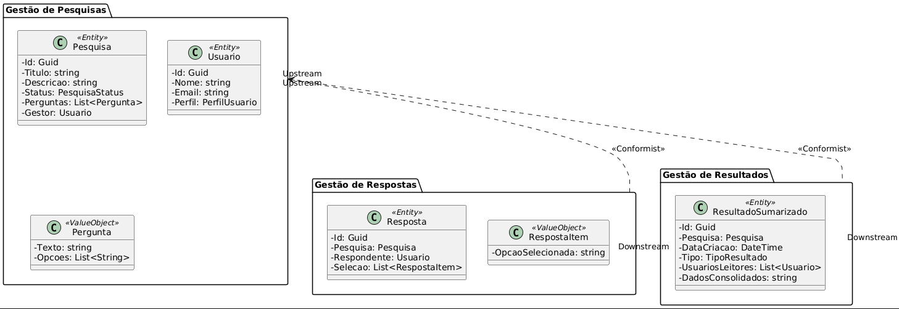
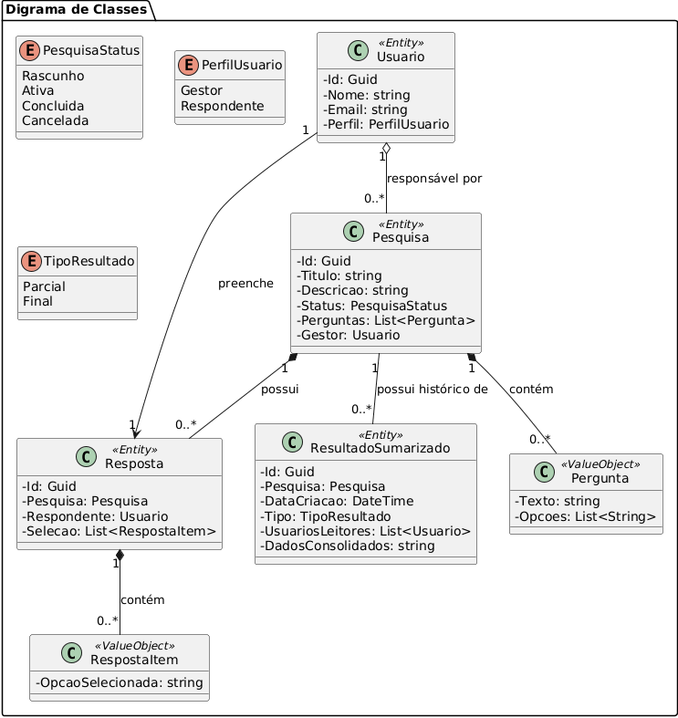

# infnet_dotnet
Repositório para o trabalho de arquitetura .NET do curso de pós graduação do INFNET

1. Modelo de Negócio
A Startup oferece uma plataforma SaaS para criação, distribuição e processamento de pesquisas públicas em larga escala. O produto permite que um **Gestor** configure uma **Pesquisa**, defina **Perguntas**, status e regras de participação.

Após a publicação da Pesquisa, o conteúdo é distribuído por canais (redes sociais, parceiros) para alcançar **Eleitores**. Quando um Eleitor participa acessa o sistema, ele pode escolher em qual pesquisa ele vai participar. Ao escolher, ele é apresentado às pergutnas daquela pesquisa que inquire o eleitor sobre alguns dados seus e sobre as suas opções de votos.

O eleitor responde às perguntas e registra suas **Respostas**. As **Respostas** contem as escolhas do eleitor. Como é um sistema de votação em eleições, sempre haverá perguntas sobre as opções de voto do eleitor, perguntando se votará em algum candidato, se irá a eleição, ou votará branco ou nulo, etc.

As respostas registradas são então submetidas ao processo de **Apuração**, que valida as entradas, aplica regras de negócio (por exemplo, checagem de duplicidade) e consolida os resultados.

Os **Resultados Sumarizados** são gerados como *snapshots* (retratos) dos dados em momentos específicos, classificados como **Parciais** ou **Finais**. Isso permite a construção de um histórico de evolução da pesquisa e garante alta performance na leitura, já que os dados consolidados são armazenados prontos para consumo, desacoplados das respostas individuais. Escala, disponibilidade e integridade dos dados são requisitos-chave: o serviço precisa manter a experiência do Eleitor e a confiança do Gestor mesmo durante picos de tráfego.

Para alinhar o time e o produto ao negócio, adotamos DDD (Domain Driven Design) e uma linguagem ubíqua com termos como Pesquisa, Cenário, Gestor, Eleitor, Voto, Recebimento, Apuração e Resultado Sumarizado.

2. Glossário de Termos

- **Pesquisa**: Agrupa uma sondagem (ex.: Eleição Municipal 2025) com título, período e opções de escolha.
- **Gestor**: Pessoa ou cliente que cria, publica e acompanha o desempenho da pesquisa.
- **Eleitor**: Participante que responde à pesquisa pela interface pública.
- **Perguntas**: Perguntas que constarão nas pesquisas. Elas serão de multipla escolha e serão textos.
- **Respostas**: Registro das escolhas do eleitor em uma pesquisa específica.
- **Apuração**: Processo que valida e consolida as respostas do eleitor para gerar os resultados oficiais.
- **Resultado Sumarizado**: Entidade que armazena o consolidado dos votos em um determinado momento (snapshot). Pode ser do tipo **Parcial** ou **Final**, permitindo que a pesquisa mantenha um histórico de evolução dos resultados.

3. Contextos principais do negócio — Versão Compacta

- **Gestão de Pesquisas** 🔧  
  Responsabilidade: criar, configurar e publicar pesquisas; inclui ações básicas de divulgação (links e campanhas).
  Valor: autonomia ao Gestor para lançar e controlar campanhas rapidamente.

- **Operação de Votos** 🟢  
  Responsabilidade: receber votos, confirmar ao eleitor, validar entradas e consolidar resultados (coleta + apuração).
  Valor: garante experiência confiável ao eleitor e credibilidade dos resultados.

- **Resultados & Relatórios** 📊  
  Responsabilidade: painéis, resumos e insights claros (totais, percentuais, filtros por cenário).
  Valor: facilita decisões rápidas e transparência para gestores e público.

Aqui está o digrama de contextos: 

Diagrama de Classes:

4. 