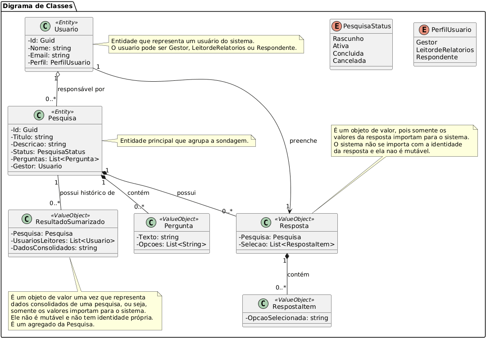

# infnet_dotnet
Repositório para o trabalho de arquitetura .NET do curso de pós graduação do INFNET

## 1. Modelo de Negócio:

  A Startup oferece uma plataforma SaaS para criação, distribuição e processamento de pesquisas públicas em larga escala. O produto permite que um **Gestor** configure uma **Pesquisa**, defina **Perguntas**, status e regras de participação.

  O **Gestor** precisa ser criado antes da pesquisa. 

  Após a publicação da Pesquisa, o conteúdo é distribuído por canais (redes sociais, parceiros) para alcançar **Eleitores**. Quando um Eleitor participa acessa o sistema, ele pode escolher em qual pesquisa ele vai participar. Ao escolher, ele é apresentado às pergutnas daquela pesquisa que inquire o eleitor sobre alguns dados seus e sobre as suas opções de votos.

  O eleitor responde às perguntas e registra suas **Respostas**. As **Respostas** contem as escolhas do eleitor. Como é um sistema de votação em eleições, sempre haverá perguntas sobre as opções de voto do eleitor, perguntando se votará em algum candidato, se irá a eleição, ou votará branco ou nulo, etc.

  Todas as perguntas devem ser respondidas de uma vez na API.

  As respostas registradas são então submetidas ao processo de **Apuração**, que valida as entradas, aplica regras de negócio (por exemplo, checagem de duplicidade) e consolida os resultados.

  Os **Resultados Sumarizados** são gerados ao final da pesquisa quando ela for encerrada (isso precisa ser acionado) e precisamos dizer quais usuarios terao acesso a este resultado.

  Para alinhar o time e o produto ao negócio, adotamos DDD (Domain Driven Design) e uma linguagem ubíqua com termos como Pesquisa, Cenário, Gestor, Eleitor, Voto, Recebimento, Apuração e Resultado Sumarizado.

## 2. Glossário de Termos

- **Pesquisa**: Agrupa uma sondagem (ex.: Eleição Municipal 2025) com título, período e opções de escolha.
- **Gestor**: Pessoa ou cliente que cria, publica e acompanha o desempenho da pesquisa.
- **Eleitor**: Participante que responde à pesquisa pela interface pública.
- **Perguntas**: Perguntas que constarão nas pesquisas. Elas serão de multipla escolha e serão textos.
- **Respostas**: Registro das escolhas do eleitor em uma pesquisa específica.
- **Apuração**: Processo que valida e consolida as respostas do eleitor para gerar os resultados oficiais.
- **Resultado Sumarizado**: Entidade que armazena o consolidado dos votos ao fim da pesquisa

## 3. Desafio

Nosso objetivo é entregar um sistema desenvolvido com ASP.NET Core 9, seguindo os princípios do Domain-Driven Design (DDD). Ele oferece uma API RESTful para realizar operações CRUD (Create, Read, Update, Delete) para as pesquisas.

**Nota:** O escopo deste projeto concentra-se exclusivamente no **Backend (API)**. Não há desenvolvimento de interface gráfica (Frontend) acoplada, sendo a API projetada para ser consumida por qualquer cliente HTTP (Web, Mobile, etc.).

## 4. Diagrama de Classes

Após a modelagem realizada, este é o uml com as principais classes do sistema:



## 5. Arquitetura em Camadas

### 1. PesqMgm.Domain (Camada de Domínio)
Coração da aplicação. Contém a lógica de negócios, entidades, Value Objects, agregados e interfaces de repositório.
Independente de qualquer tecnologia de infraestrutura ou UI. Não conhece banco de dados, frameworks web, etc.
Foco: Modelar o problema de negócio de forma rica e expressiva.

### 2. PesqMgm.Infrastructure.Data (Camada de Infraestrutura)
Responsável pela persistência de dados e outras preocupações técnicas.
Implementa as interfaces de repositório definidas na camada de Domínio.
Utiliza Entity Framework Core para interagir com o banco de dados (InMemory Database).
Contém configurações de mapeamento de entidades para o banco de dados.
Add-Migration Initial -Context PesquisasDbContext -Project PesqMgm.Infrastructure.Data -StartupProject PesqMgm.Api

Dentro de PesquisaDbContext, no mapeamento para os bancos de dados, foi necessário mapear ResultadoSumarizado como uma entidade para que fosse possivel associar os usuarios leitores a este resultado, apesar de ele ser um objeto de valor.

### 3. PesqMgm.API (Camada de Apresentação/Aplicação)

Ponto de entrada da aplicação. Expõe a funcionalidade de negócio através de uma API RESTful.
Contém controladores (Controllers) para Pesquisa e Usuario que recebem requisições HTTP, orquestram as operações de domínio e retornam respostas HTTP. NO nosso caso, este projeto/camada está fazendo os papeis de apresentação e aplicação. Em teoria, a API seria só a camada de apresentação e teria as rotas das requisicoes, mas pela simplicidade da aplicação, fizemos esta otimização para diminuir código, custos e recursos computacionais.

Utiliza DTOs (Data Transfer Objects) para desacoplar a API do modelo de domínio.
Configura a injeção de dependência e o pipeline da aplicação (middleware) no arquivo Program.cs.

Esta camada precisa enxergar todas as camadas da aplicacao (Dominio e Repository neste caso) para fazer a orquestração.

### 4. PesqMgm.Infrastructure.Data.Tests (Camada de Testes de Infraestrutura)
Contém testes unitários para a implementação do repositório, garantindo que a persistência de dados funcione corretamente. Não foi possível terminar esta parte do código.

### 5. PesqMgm.Domain.Tests (Camada de Testes de Domínio)
Contém testes unitários para as entidades e Value Objects do domínio, garantindo que a lógica de negócio esteja correta e robusta. Não foi possível terminar esta parte do código.

## 6. Componentes .NET e Justificativas

Para atender aos requisitos de robustez, escalabilidade e manutenibilidade, a solução foi construída sobre a plataforma **.NET 9**, utilizando os seguintes componentes fundamentais:

*   **ASP.NET Core Web API**: Escolhido para o desenvolvimento do Backend devido à sua alta performance, suporte nativo a injeção de dependência e facilidade na criação de serviços RESTful. Ele garante o funcionamento da solução através do pipeline de middlewares (tratamento de erros, roteamento, validação).
*   **Entity Framework Core (EF Core)**: Escolhido como ORM (Object-Relational Mapper) para abstrair o acesso a dados. Sua escolha se justifica pela produtividade (LINQ), suporte a Migrations para versionamento do banco de dados e capacidade de mapear objetos complexos de domínio (Value Objects) para o modelo relacional.
*   **InMemory Database**: Banco de dados em memória utilizado para simplificar o a implementação conforme alinhado com o demandante do projeto, permitindo validação rápida da lógica de negócio sem a necessidade de infraestrutura externa complexa.
*   **xUnit**: Framework de testes escolhido para garantir a qualidade do código através de testes unitários automatizados nas camadas de Domínio e Infraestrutura.

A arquitetura garante o funcionamento da solução isolando a complexidade de negócio na camada de Domínio, enquanto o ASP.NET Core gerencia a exposição dos serviços e o EF Core gerencia a persistência, tudo acoplado via Injeção de Dependência.

## 7. Estratégia de Frontend e Integração

Embora o escopo deste projeto seja focado no **Backend (API)**, a arquitetura foi desenhada seguindo o modelo **API-First**, preparando o sistema para integração com qualquer frontend (Web, Mobile, Desktop).

*   **Componente de "Frontend" Atual**: Para fins de validação e interação imediata com os stakeholders e desenvolvedores, utilizamos o **Swagger (OpenAPI)** e **Postman**. Eles atuam como a interface cliente, permitindo testar e visualizar os fluxos de negócio.
*   **Protocolo de Comunicação**: A integração entre o Backend e qualquer futuro Frontend ocorre via **HTTP/HTTPS**, utilizando o padrão **REST** e troca de mensagens em formato **JSON**.
*   **Justificativa da Abordagem**: A escolha de não acoplar um frontend específico (Razor/Blazor) neste momento e focar na API RESTful permite que o sistema seja consumido por múltiplas interfaces diferentes no futuro (ex: App Mobile para eleitores, Dashboard Web para gestores), garantindo flexibilidade e desacoplamento.

## 8. Estratégia de Testes

A solução demonstra a testabilidade dos componentes em diferentes níveis:

1.  **Testes de Unidade (xUnit)**: Localizados nos projetos `PesqMgm.Domain.Tests` e `PesqMgm.Infrastructure.Tests`. Validam regras de negócio (ex: validação de voto, criação de pesquisa) e lógica de mapeamento de dados isoladamente.
2.  **Testes de Integração/API (Postman)**: A collection do Postman (`docs/Infnet_PesqMgm.postman_collection.json`) serve para testar o componente Web (API) como um todo, simulando fluxos reais de uso (Criar Gestor -> Criar Pesquisa -> Votar -> Apurar).
3.  **Testabilidade do Acesso a Dados**: O uso do padrão Repository permite que a persistência seja testada com bancos em memória ou mocks, garantindo que o EF Core esteja configurado corretamente sem depender do banco de produção.

## 9. Padrões de Projeto Utilizados
*   **Domain-Driven Design (DDD)**: Foco na modelagem do domínio de negócio, com linguagem ubíqua e conceitos de Aggregate Roots, Value Objects e Repositories.
    *   *Exemplo*: Estrutura da solução dividida em `Infnet.PesqMgm.Domain` (regras puras) e `Infnet.PesqMgm.Infrastructure`.
*   **Repository Pattern**: Abstrai a lógica de persistência de dados, permitindo que a camada de domínio trabalhe com coleções de objetos sem se preocupar com os detalhes do armazenamento.
    *   *Exemplo*: Interface `IPesquisaRepository.cs` no Domínio e implementação `InMemoryPesquisaRepository.cs` na Infraestrutura.
*   **Factory Pattern**: Utilizado nos métodos estáticos de criação para encapsular a lógica de validação e garantir que os objetos sejam instanciados em um estado válido.
    *   *Exemplo*: Método `Pesquisa.Criar(...)` na classe `Pesquisa.cs`.
*   **Value Object Pattern**: Objetos que representam um conceito descritivo, definidos pela sua composição de atributos e imutabilidade.
    *   *Exemplo*: Classes `Pergunta` e `Resposta`, mapeadas como `OwnsMany` no `PesquisaDbContext.cs`.
*   **Aggregate Root Pattern**: Entidades que são a raiz de um cluster de objetos, garantindo a consistência transacional.
    *   *Exemplo*: A classe `Pesquisa.cs` controla o acesso às listas de `Perguntas` e `Respostas`, impedindo modificações diretas externas.
*   **Dependency Injection (DI)**: Utilizado para gerenciar as dependências entre as camadas e componentes.
    *   *Exemplo*: Configuração em `Program.cs` (`builder.Services.AddScoped...`) e injeção via construtor no `PesquisasController.cs`.
*   **Fluent API (EF Core)**: Usada para configurar o mapeamento objeto-relacional de forma programática.
    *   *Exemplo*: Método `OnModelCreating` em `PesquisaDbContext.cs` configurando chaves e relacionamentos complexos.
*   **RESTful API**: A camada de apresentação segue os princípios REST para comunicação.
    *   *Exemplo*: `PesquisasController.cs` utilizando verbos HTTP (`[HttpGet]`, `[HttpPost]`) e DTOs para transferência de dados.

## 10. Documentação da API

A API foi documentada com a collection do Postman que está na pasta docs do repositório (docs/Infnet_PesqMgm.postman_collection.json). Definimos endpoints que cobrem as ações de negócio que serão feitas por uma futura camada de apresentação para o cliente final.

## 11. Guia de Execução (Codespaces e Docker)

Este projeto foi desenvolvido dentro do github utiliznado a funcionalidade do codespaces. Para rodar o projeto no codespace, basta criar o codespace na branch desejada e executar os passos abaixo:

### 1. HTTP vs HTTPS
*   A aplicação foi configurada para rodar internamente em **HTTP** na porta **5163** (padrão de containers .NET).

### 2. Como Rodar (Via Terminal / Codespaces)
Em ambientes como Codespaces, o **HTTPS** é fornecido automaticamente pelo túnel do GitHub (SSL termination). Portanto, o redirecionamento forçado para HTTPS dentro da aplicação (`app.UseHttpsRedirection`) deve ser desativado para evitar loops de redirecionamento ou erros de conexão.

Para executar a API diretamente no terminal garantindo que ela esteja acessível externamente, utilize o comando abaixo:

```bash
dotnet run --project src/Infnet.PesqMgm.Api/Infnet.PesqMgm.Api.csproj
```
Voce pode entao usar a extensao do postman dentro do codespace para testar a API importando o arquivo json da pasta docs.

Você também pode acessar o swagger da seguinte forma: execute o projeto e após a execução, vá até a aba PORTS no VS Code, localize a porta **5163** e clique no ícone do globo ("Open in Browser"). Adicione /swagger ao final da URL para visualizar a documentação.

### 3. Como Rodar (Via Docker) 

Para construir e executar a aplicação isolada em um container, utilizando o Dockerfile na raiz do repositório:

#### 1. Construa a imagem:
```bash
docker build -t infnet-pesqmgm .
```

#### 2. Execute o container:
```bash
docker run -p 5163:8080 infnet-pesqmgm
```
